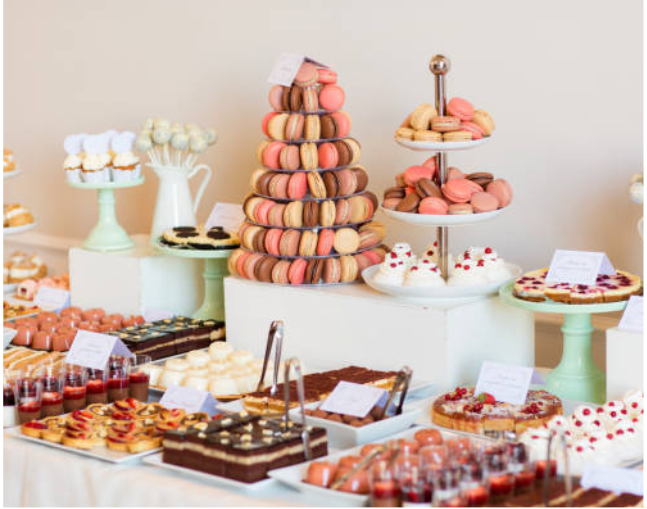
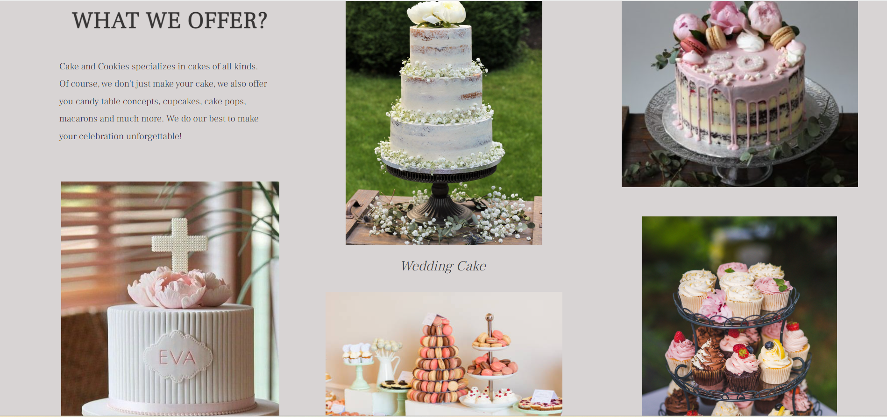
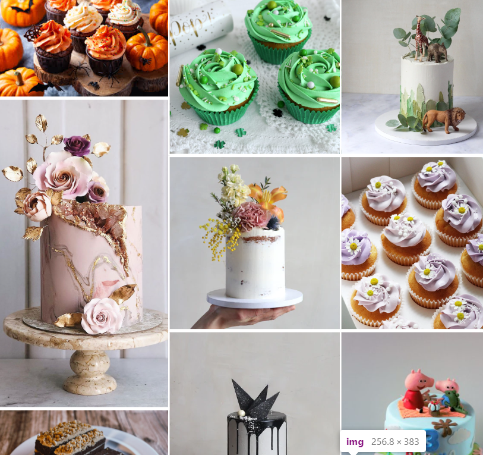
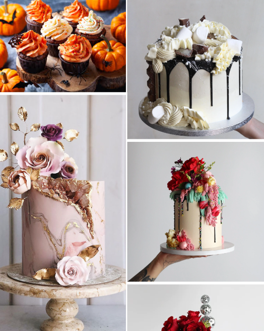

# CAKES & COOKIES

Cakes & Cookies is a Baking business located in Halstatt,Austria,concentrating on wedding cakes,themed cakes and much more.This website is aimed at giving more information about their products and services to the public and thereby increasing the number of clients.

## DEMO

---

A live demo of the site can be found [here.](https://sari-rahul.github.io/cakes-and-cookies/)

## LANGUAGES USED

---

- HTML
- CSS

## FEATURES

---

There are Four pages in this website. The main features of this website are as follows:

### 1.HOME

The first page or the landing page with all the necessary information related to the business.

#### i) Logo and navigation bar

The website begins with the logo of the firm aligned centrally followed by the navigation bar.The navigation bar has four elements -Home,Services,Gallery and Contact. Each element helps the user to navigate through the pages and get information.The logo brings the user back to the home page while navigating through any other page,when clicked.
The structure and pattern of the navigation bar and logo remains the same throughout the website pages.

#### ii) Cover Page

The cover page of this website displays the images of different cakes made by them.The main aim is to showcase their work and attract the clients.The number of images displayed differs according to the screen sizes. In the larger screens five images are displayed while only three images are shown in medium screen sizes which is reduced to one on mobile screen.

### iii) Welcome Section

This is a small section welcoming the client to the website and quoting the motto of the business.

### iv) Offer of the Month

This section describes the current offer provided by the bakers. It will be updated once in a month to the current offer. It includes the image and details of the cake currently in offer.The portion size,flavour,decorations used and the lead time will be displayed here.

This section is displayed in one above the other pattern in smaller screens as shown below:

### v) What we Offer?

Here the entire products and services provided are shown. It includes images and names of the types of the cakes that can be ordered. It aims at imforming the clients about the services offered.

This same section is shown in different pattern in smaller screens. Each section is arranged one above the other to accomodate in the smaller width.

### vi) Customer Reviews

For any business customer satisfaction is very important.The credibility of any service increases with genuine reviews from the customers. Hence the reviews are given on the front page itself to increase the confidence of new customers. It can be updated and reviwed.

- It is displayed in aline in larger screen as shown below.

- While in smaller screens it is shown in single column.

### vii) Footer

Each page ends with a footer. It includes essential informations like location,contact details and a form to subscribe to their newsletter,so that they remain updated with the current offers.The footer is displayed in single line in larger screens and one below the other in smaller screens.

## 2.SERVICES

This is the second page in this website. It has three main sections.

### i) Price List

Here, the prices of different cakes as per their sizes and portions are detailed. It also includes the images respectively with the discription. It also has a section which includes price details of other services they provide like cupcakes,cakesicles along with their images.

- Pricelist on large screen is seen as below with two column in each row:
  
- second part of pricelist is displayed in single line with the cost and numbers displayed below each object:
  

  - In smaller screen the pricelist is shown as single column in each row one below the other.

    .

  - Smaller screen shows the pricelist of other things one below the other as shown:

    

### ii) Flavour Guide

All the flavours currently available are explained here. It informs the user to know about the flavours available along with texture and combination of the taste of cake they are ordering. It also helps create customised cake where the client can choose the flavours from the chart provided.

### iii) How to Order?

Once the customer is informed about the product the question that comes is how to get this product? This question is simply and effectively answered here using a simple chart like explanation and logos.

- How to order section on large screen.

- How to order section on smaller screen.

## 3.GALLERY

This section showcases images of the works done before. It helps new customers refer the images and to get new ideas from them. It changes accordingly with the screen sizes as shown below:

- In larger screen it shows four images in a row.
  

- Medium screen shows three images in a row.

  

- Only two columns are displayed in smaller screen.

  

## 4.CONTACT

The last and most important page in this website. It has two section.

### i) Form

After going through these website pages,if the customer has any questions they can ask their question using the form provided in this section.Equally important is the giving reviews and suggestions for the progress of this business which can also be done through this section. It also has an image to make it look beautiful which is displayed only on larger screens.

- Contact form on large screens
  

- Contact form on small screens without image and smaller button on the form.

  

### ii) Contact

In this section the contact informations like location,phone numbers,email address and social media links are provided.
It remains the same on all screen sizes.

## TESTING

---

### Lighthouse

---

This project has been tested throughly using the dev tools during the development process and has behaved accordingly in all required screen sizes. After completion it has been tested in lighthouse and has a good score for accessibilty, performance,SEO and Best practices.

- [Lighthouse test of home page.](assets/images/lighthousehome.png)
- [Lighthouse test of services page.](assets/images/lighthouseservices.png)
- [Lighthouse test for gallery.](assets/images/lighthousegallery.png)
- [Lighthouse test for contact](assets/images/lighthousecontact.png)

### Full Testing

---

Full testing was performed on the following devices:

- Laptop:
  - HP 15-dw3205ng Notebook
- Mobile Devices:
  - iPhone 11 pro max.
  - Vivo Y73.

Each device tested the site using the following browsers:

- Google Chrome
- Safari
- Microsoft Edge

### Validator Testing

---

#### HTML

No errors have been found while passing through official [W3C Validator](https://validator.w3.org/nu/?showsource=yes&doc=https%3A%2F%2Fsari-rahul.github.io%2Fcakes-and-cookies%2F).

#### CSS

No errors have been found while pasing through official [Jigsaw validator.](https://jigsaw.w3.org/css-validator/validator?uri=https%3A%2F%2Fsari-rahul.github.io%2Fcakes-and-cookies%2F&profile=css3svg&usermedium=all&warning=1&vextwarning=&lang=en)

### Manual Testing

---

| Feature              | Expected Outcome                                               | Testing Performed | Result                           | Pass/Fail |
| -------------------- | -------------------------------------------------------------- | ----------------- | -------------------------------- | --------- |
| `Navbar`             |
|                      |                                                                |                   |                                  |           |
| Cakes & Cookies Logo | When clicked the user will be redirected to the home page.     | Clicked Logo      | Redirected to the home page.     | Pass      |
| Home Page Link       | When clicked the user will be redirected to the home page.     | Clicked link      | Redirected to the home page.     | Pass      |
| Services Page Link   | When clicked the user will be redirected to the services page. | Clicked link      | Redirected to the services page. | Pass      |
| Gallery Page Link    | When clicked the user will be redirected to the gallery page.  | Clicked link      | Redirected to the gallery page.  | Pass      |
| Contact Page Link    | When clicked the user will be redirected to the contact page.  | Clicked link      | Redirected to the contact page.  | Pass      |
| `Contact`            |
|                      |                                                                |                   |                                  |           |
| Facebook Logo        | When clicked the user will be redirected to the facebook page. | Clicked link      | Redirected to the facebook page. | Pass      |
| Instagram Logo       | When clicked the user will be redirected to the Instagram.     | Clicked link      | Redirected to the Instagram.     | Pass      |

## DEPLOYMENT

---

This project was deployed first on 12th of july 2023 in the Github platform.
The steps of deployment are as follows:

- In the github ,select the repository.
- Go to the settings ,select Pages from the left side.
- In pages ,change the Branch into main and Save it.
- Wait for few minutes and the link to the repository will be loaded above.

The live link can be found [here.](https://sari-rahul.github.io/cakes-and-cookies/)

## CREDITS

---

The credits of this projects are:

### Content

- The content and concept of this project was refferd from the Cake styling and Cakes Berlin websites.They are bakers based in Stuttgart and Berlin respectively.

- The instructions for implementation was taken from the [Debug Media](https://www.youtube.com/watch?v=uhWvXeCEbHw) youtube channel.

- The icons were used from [Font Awesome.](https://fontawesome.com/v5/download)

### Media

- The images used inthis project are from [Pexels](https://www.pexels.com/de-de/),[Cakes Berlin](https://cakesberlin.com/) and [Cake Styling](https://www.cakestyling.de/)
